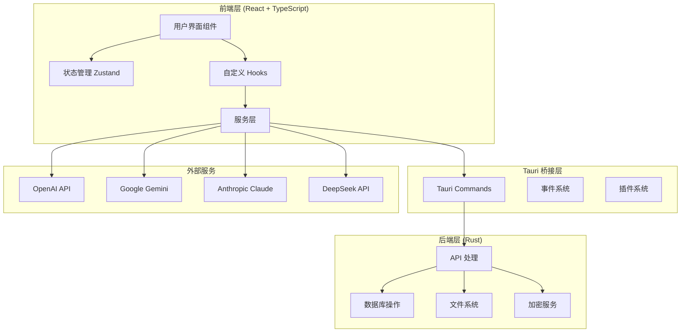

# 开发指南

本指南将帮助开发者快速上手 Semantic Writing Assistant 项目的开发工作，包括环境搭建、代码规范、开发流程等。

## 目录

- [开发环境搭建](#开发环境搭建)
- [项目架构](#项目架构)
- [开发规范](#开发规范)
- [调试指南](#调试指南)
- [测试策略](#测试策略)
- [性能优化](#性能优化)
- [部署流程](#部署流程)

## 开发环境搭建

### 必要工具安装

#### 1. Node.js 环境
```bash
# 推荐使用 nvm 管理 Node.js 版本
curl -o- https://raw.githubusercontent.com/nvm-sh/nvm/v0.39.0/install.sh | bash
nvm install 18
nvm use 18

# 验证安装
node --version  # 应该显示 v18.x.x
npm --version   # 应该显示 9.x.x
```

#### 2. Rust 环境
```bash
# 安装 Rust
curl --proto '=https' --tlsv1.2 -sSf https://sh.rustup.rs | sh
source ~/.cargo/env

# 验证安装
rustc --version  # 应该显示 1.70+
cargo --version  # 应该显示对应版本
```

#### 3. 包管理器
```bash
# 安装 pnpm (推荐)
npm install -g pnpm

# 或者使用 yarn
npm install -g yarn
```

#### 4. 开发工具
```bash
# VS Code 扩展推荐
code --install-extension rust-lang.rust-analyzer
code --install-extension tauri-apps.tauri-vscode
code --install-extension bradlc.vscode-tailwindcss
code --install-extension esbenp.prettier-vscode
code --install-extension dbaeumer.vscode-eslint
```

### 项目克隆和初始化

```bash
# 克隆项目
git clone https://github.com/your-username/semantic-writing-assistant.git
cd semantic-writing-assistant

# 安装前端依赖
pnpm install

# 安装 Tauri CLI
cargo install tauri-cli

# 验证 Tauri 环境
cargo tauri info
```

### 环境变量配置

创建 `.env` 文件：

```env
# 开发环境配置
VITE_DEV_MODE=true
VITE_LOG_LEVEL=debug

# AI API 配置 (开发用)
VITE_OPENAI_API_KEY=your_openai_api_key_here
VITE_GEMINI_API_KEY=your_gemini_api_key_here
VITE_CLAUDE_API_KEY=your_claude_api_key_here
VITE_DEEPSEEK_API_KEY=your_deepseek_api_key_here

# 应用配置
VITE_APP_NAME="Semantic Writing Assistant (Dev)"
VITE_APP_VERSION=1.0.0-dev

# 数据库配置
VITE_DB_NAME=semantic_writing_dev.sqlite
VITE_DB_MIGRATIONS_PATH=./src-tauri/migrations

# 网络配置
VITE_API_TIMEOUT=30000
VITE_MAX_RETRIES=3
```

### 开发服务器启动

```bash
# 启动前端开发服务器
pnpm dev

# 启动 Tauri 开发环境 (推荐)
pnpm tauri dev

# 仅构建前端 (用于调试)
pnpm build

# 构建 Tauri 应用
pnpm tauri build
```

## 项目架构

### 目录结构详解

```
semantic-writing-assistant/
├── src/                          # 前端源代码
│   ├── components/              # React 组件
│   │   ├── AI/                 # AI 相关组件
│   │   │   ├── AIAssistantPage.tsx
│   │   │   ├── AIConfiguration.tsx
│   │   │   └── index.ts
│   │   ├── AIWriting/          # AI 写作组件
│   │   │   ├── AIWritingPage.tsx
│   │   │   └── index.ts
│   │   ├── Editor/             # 编辑器组件
│   │   │   ├── MainEditor.tsx
│   │   │   ├── RichTextEditor.tsx
│   │   │   ├── EditorToolbar.tsx
│   │   │   └── index.ts
│   │   ├── Layout/             # 布局组件
│   │   │   ├── Layout.tsx
│   │   │   ├── Header.tsx
│   │   │   ├── Sidebar.tsx
│   │   │   ├── AppShortcuts.tsx
│   │   │   └── index.ts
│   │   ├── ui/                 # 通用 UI 组件
│   │   │   ├── button.tsx
│   │   │   ├── input.tsx
│   │   │   ├── card.tsx
│   │   │   ├── ThemeSelector.tsx
│   │   │   ├── ThemeToggle.tsx
│   │   │   └── index.ts
│   │   └── tools/              # 工具组件
│   │       ├── RewritingTool.tsx
│   │       ├── TranslationTool.tsx
│   │       ├── SEOTool.tsx
│   │       └── index.ts
│   ├── hooks/                   # 自定义 Hooks
│   │   ├── useAutoSave.ts
│   │   ├── useShortcuts.ts
│   │   ├── useSemanticAnalysis.ts
│   │   ├── use-toast.ts
│   │   └── index.ts
│   ├── services/               # 服务层
│   │   ├── core/              # 核心服务
│   │   │   ├── platformService.ts
│   │   │   └── index.ts
│   │   ├── aiService.ts       # AI 服务
│   │   ├── semanticEngine.ts  # 语义分析引擎
│   │   ├── tauriService.ts    # Tauri 服务
│   │   └── index.ts
│   ├── stores/                 # 状态管理
│   │   ├── appStore.ts        # 主应用状态
│   │   ├── documentStore.ts   # 文档状态
│   │   ├── aiStore.ts         # AI 服务状态
│   │   └── index.ts
│   ├── contexts/              # React Context
│   │   ├── ThemeContext.tsx
│   │   └── index.ts
│   ├── types/                 # TypeScript 类型定义
│   │   ├── index.ts          # 通用类型
│   │   ├── tauri.ts          # Tauri 相关类型
│   │   ├── platform.ts       # 平台相关类型
│   │   └── ai.ts             # AI 相关类型
│   ├── utils/                 # 工具函数
│   │   ├── nlp.ts            # 自然语言处理
│   │   ├── termExtractor.ts  # 术语提取
│   │   ├── workerManager.ts  # Web Worker 管理
│   │   └── index.ts
│   ├── styles/               # 样式文件
│   │   ├── index.css        # 主样式文件
│   │   ├── themes.css       # 主题样式
│   │   └── components.css   # 组件样式
│   ├── modules/             # 功能模块
│   │   ├── collaboration/   # 协作模块
│   │   ├── grammar-check/   # 语法检查模块
│   │   ├── translation/     # 翻译模块
│   │   ├── text-generation/ # 文本生成模块
│   │   ├── rewriting/       # 改写模块
│   │   ├── summarization/   # 摘要模块
│   │   ├── seo/            # SEO 优化模块
│   │   └── templates/       # 模板模块
│   ├── App.tsx             # 主应用组件
│   ├── main.tsx           # 应用入口
│   └── vite-env.d.ts      # Vite 类型定义
├── src-tauri/              # Tauri 后端代码
│   ├── src/               # Rust 源代码
│   │   ├── commands/      # Tauri 命令
│   │   │   ├── document.rs
│   │   │   ├── file.rs
│   │   │   ├── database.rs
│   │   │   └── mod.rs
│   │   ├── database/      # 数据库模块
│   │   │   ├── models.rs
│   │   │   ├── schema.rs
│   │   │   ├── migrations.rs
│   │   │   └── mod.rs
│   │   ├── services/      # 后端服务
│   │   │   ├── file_service.rs
│   │   │   ├── document_service.rs
│   │   │   └── mod.rs
│   │   ├── utils/         # 工具函数
│   │   │   ├── crypto.rs
│   │   │   ├── file_utils.rs
│   │   │   └── mod.rs
│   │   ├── main.rs        # 主程序入口
│   │   └── lib.rs         # 库入口
│   ├── migrations/        # 数据库迁移文件
│   ├── Cargo.toml        # Rust 依赖配置
│   ├── tauri.conf.json   # Tauri 配置文件
│   └── build.rs          # 构建脚本
├── public/               # 静态资源
│   ├── icons/           # 应用图标
│   ├── fonts/           # 字体文件
│   └── images/          # 图片资源
├── docs/                # 项目文档
│   ├── API.md          # API 文档
│   ├── DEVELOPMENT.md  # 开发指南
│   ├── DEPLOYMENT.md   # 部署指南
│   └── ARCHITECTURE.md # 架构文档
├── tests/              # 测试文件
│   ├── unit/          # 单元测试
│   ├── integration/   # 集成测试
│   └── e2e/           # 端到端测试
├── scripts/           # 构建和部署脚本
│   ├── build.sh      # 构建脚本
│   ├── deploy.sh     # 部署脚本
│   └── test.sh       # 测试脚本
├── .env.example      # 环境变量示例
├── .gitignore        # Git 忽略文件
├── package.json      # 项目配置
├── tsconfig.json     # TypeScript 配置
├── tailwind.config.js # Tailwind CSS 配置
├── vite.config.ts    # Vite 配置
└── README.md         # 项目说明
```

### 技术架构图



## 开发规范

### 代码风格规范

#### TypeScript/React 规范

```typescript
// 1. 组件命名使用 PascalCase
const DocumentEditor: React.FC<DocumentEditorProps> = ({ 
  document, 
  onSave, 
  onClose 
}) => {
  // 2. 状态和变量使用 camelCase
  const [isLoading, setIsLoading] = useState(false);
  const [documentContent, setDocumentContent] = useState('');

  // 3. 常量使用 UPPER_SNAKE_CASE
  const MAX_DOCUMENT_SIZE = 10 * 1024 * 1024; // 10MB

  // 4. 使用 useCallback 优化性能
  const handleSave = useCallback(async () => {
    if (!documentContent.trim()) {
      return;
    }

    setIsLoading(true);
    try {
      await onSave(documentContent);
    } catch (error) {
      console.error('保存失败:', error);
    } finally {
      setIsLoading(false);
    }
  }, [documentContent, onSave]);

  // 5. 使用 useEffect 处理副作用
  useEffect(() => {
    // 自动保存逻辑
    const autoSaveTimer = setInterval(() => {
      if (documentContent !== document.content) {
        handleSave();
      }
    }, 30000); // 30秒自动保存

    return () => clearInterval(autoSaveTimer);
  }, [documentContent, document.content, handleSave]);

  // 6. 条件渲染使用逻辑运算符
  return (
    <div className="document-editor">
      {isLoading && <LoadingSpinner />}
      <textarea
        value={documentContent}
        onChange={(e) => setDocumentContent(e.target.value)}
        disabled={isLoading}
      />
      <div className="editor-actions">
        <button onClick={handleSave} disabled={isLoading}>
          保存
        </button>
        <button onClick={onClose}>
          关闭
        </button>
      </div>
    </div>
  );
};

// 7. 接口定义使用 interface
interface DocumentEditorProps {
  document: Document;
  onSave: (content: string) => Promise<void>;
  onClose: () => void;
}

// 8. 类型定义使用 type (用于联合类型等)
type DocumentStatus = 'draft' | 'published' | 'archived';
type Theme = 'light' | 'dark' | 'auto';

// 9. 枚举使用 enum
enum ErrorCode {
  NETWORK_ERROR = 'NETWORK_ERROR',
  VALIDATION_ERROR = 'VALIDATION_ERROR',
  UNKNOWN_ERROR = 'UNKNOWN_ERROR'
}
```

#### Rust 规范

```rust
// 1. 模块和文件名使用 snake_case
mod document_service;
mod file_utils;

// 2. 结构体使用 PascalCase
#[derive(Debug, Serialize, Deserialize)]
struct Document {
    id: String,
    title: String,
    content: String,
    created_at: DateTime<Utc>,
    updated_at: DateTime<Utc>,
}

// 3. 函数和变量使用 snake_case
fn create_document(title: String, content: String) -> Result<Document, DatabaseError> {
    let document_id = generate_uuid();
    let current_time = Utc::now();
    
    let document = Document {
        id: document_id,
        title,
        content,
        created_at: current_time,
        updated_at: current_time,
    };
    
    save_document_to_database(&document)?;
    Ok(document)
}

// 4. 常量使用 UPPER_SNAKE_CASE
const MAX_FILE_SIZE: usize = 10 * 1024 * 1024; // 10MB
const DEFAULT_TIMEOUT: Duration = Duration::from_secs(30);

// 5. 错误处理使用 Result 类型
#[derive(Debug, thiserror::Error)]
enum DatabaseError {
    #[error("连接失败: {0}")]
    ConnectionFailed(String),
    #[error("查询失败: {0}")]
    QueryFailed(String),
    #[error("数据不存在")]
    NotFound,
}

// 6. Tauri 命令函数
#[tauri::command]
async fn get_document(
    state: tauri::State<'_, AppState>,
    document_id: String,
) -> Result<Option<Document>, String> {
    let db = state.database.lock().await;
    
    match db.get_document(&document_id).await {
        Ok(document) => Ok(document),
        Err(e) => {
            eprintln!("获取文档失败: {}", e);
            Err(format!("获取文档失败: {}", e))
        }
    }
}

// 7. 异步函数使用 async/await
async fn save_document_async(document: &Document) -> Result<(), DatabaseError> {
    let connection = get_database_connection().await?;
    
    sqlx::query!(
        "INSERT INTO documents (id, title, content, created_at, updated_at) 
         VALUES ($1, $2, $3, $4, $5)",
        document.id,
        document.title,
        document.content,
        document.created_at,
        document.updated_at
    )
    .execute(&connection)
    .await
    .map_err(|e| DatabaseError::QueryFailed(e.to_string()))?;
    
    Ok(())
}
```

### Git 提交规范

#### 提交信息格式

```
<type>(<scope>): <description>

[optional body]

[optional footer(s)]
```

#### 类型说明

- `feat`: 新功能
- `fix`: 修复 bug
- `docs`: 文档更新
- `style`: 代码格式调整（不影响功能）
- `refactor`: 代码重构
- `perf`: 性能优化
- `test`: 测试相关
- `chore`: 构建工具或辅助工具的变动
- `ci`: CI/CD 相关
- `build`: 构建系统相关

#### 示例

```bash
# 新功能
git commit -m "feat(ai): 添加 Claude API 集成"

# 修复 bug
git commit -m "fix(editor): 修复自动保存失效问题"

# 文档更新
git commit -m "docs(api): 更新 AI 服务 API 文档"

# 重构
git commit -m "refactor(components): 重构编辑器组件结构"

# 性能优化
git commit -m "perf(semantic): 优化术语提取算法性能"
```

### 分支管理策略

```bash
# 主分支
main              # 生产环境代码
develop           # 开发环境代码

# 功能分支
feature/ai-writing      # AI 写作功能
feature/collaboration   # 协作功能
feature/ui-redesign     # UI 重设计

# 修复分支
hotfix/critical-bug     # 紧急 bug 修复
bugfix/editor-crash     # 编辑器崩溃修复

# 发布分支
release/v1.0.0          # 版本发布准备
```

#### 工作流程

```bash
# 1. 从 develop 创建功能分支
git checkout develop
git pull origin develop
git checkout -b feature/new-feature

# 2. 开发功能
git add .
git commit -m "feat: 添加新功能"
git push origin feature/new-feature

# 3. 创建 Pull Request
# 在 GitHub/GitLab 上创建 PR，请求合并到 develop

# 4. 代码审查和合并
# 经过代码审查后合并到 develop

# 5. 发布准备
git checkout develop
git pull origin develop
git checkout -b release/v1.0.0

# 6. 合并到 main 并打标签
git checkout main
git merge release/v1.0.0
git tag v1.0.0
git push origin main --tags
```

## 调试指南

### 前端调试

#### 1. 浏览器开发者工具

```typescript
// 在组件中添加调试日志
const DocumentEditor: React.FC = () => {
  const [content, setContent] = useState('');

  // 调试状态变化
  useEffect(() => {
    console.log('内容更新:', content);
  }, [content]);

  // 调试性能
  const expensiveCalculation = useMemo(() => {
    console.time('计算耗时');
    const result = performExpensiveCalculation(content);
    console.timeEnd('计算耗时');
    return result;
  }, [content]);

  return (
    <div>
      {/* 组件内容 */}
    </div>
  );
};
```

#### 2. React Developer Tools

```bash
# 安装 React DevTools 浏览器扩展
# Chrome: https://chrome.google.com/webstore/detail/react-developer-tools/fmkadmapgofadopljbjfkapdkoienihi
# Firefox: https://addons.mozilla.org/en-US/firefox/addon/react-devtools/
```

#### 3. Redux DevTools (用于状态调试)

```typescript
// 在 Zustand store 中启用 DevTools
import { devtools } from 'zustand/middleware';

const useAppStore = create<AppState>()(
  devtools(
    (set, get) => ({
      // store 实现
    }),
    {
      name: 'app-store', // DevTools 中显示的名称
    }
  )
);
```

### Tauri 后端调试

#### 1. 启用 Rust 日志

```rust
// 在 main.rs 中启用日志
use log::{info, warn, error, debug};

fn main() {
    // 初始化日志
    env_logger::init();
    
    tauri::Builder::default()
        .setup(|app| {
            info!("应用启动");
            Ok(())
        })
        .run(tauri::generate_context!())
        .expect("error while running tauri application");
}

// 在命令中使用日志
#[tauri::command]
async fn process_document(content: String) -> Result<String, String> {
    debug!("开始处理文档，内容长度: {}", content.len());
    
    // 处理逻辑
    let result = process_content(&content);
    
    match result {
        Ok(processed) => {
            info!("文档处理成功");
            Ok(processed)
        }
        Err(e) => {
            error!("文档处理失败: {}", e);
            Err(format!("处理失败: {}", e))
        }
    }
}
```

#### 2. 环境变量配置

```bash
# 设置 Rust 日志级别
export RUST_LOG=debug

# 启动开发服务器
pnpm tauri dev
```

#### 3. 使用 Rust 调试器

```bash
# 安装 LLDB (macOS) 或 GDB (Linux)
# 在 VS Code 中安装 CodeLLDB 扩展

# 在 .vscode/launch.json 中配置调试
{
  "version": "0.2.0",
  "configurations": [
    {
      "type": "lldb",
      "request": "launch",
      "name": "Tauri Debug",
      "cargo": {
        "args": ["build", "--manifest-path=src-tauri/Cargo.toml"],
        "filter": {
          "name": "semantic-writing-assistant",
          "kind": "bin"
        }
      },
      "args": [],
      "cwd": "${workspaceFolder}"
    }
  ]
}
```

### 网络请求调试

#### 1. 拦截和记录请求

```typescript
// 创建 API 客户端拦截器
class APIClient {
  private baseURL: string;

  constructor(baseURL: string) {
    this.baseURL = baseURL;
  }

  async request<T>(
    endpoint: string, 
    options: RequestInit = {}
  ): Promise<T> {
    const url = `${this.baseURL}${endpoint}`;
    
    // 记录请求
    console.log('API 请求:', {
      method: options.method || 'GET',
      url,
      headers: options.headers,
      body: options.body
    });

    const startTime = Date.now();
    
    try {
      const response = await fetch(url, {
        ...options,
        headers: {
          'Content-Type': 'application/json',
          ...options.headers
        }
      });

      const endTime = Date.now();
      
      // 记录响应
      console.log('API 响应:', {
        url,
        status: response.status,
        statusText: response.statusText,
        duration: endTime - startTime
      });

      if (!response.ok) {
        throw new Error(`HTTP ${response.status}: ${response.statusText}`);
      }

      const data = await response.json();
      return data;
    } catch (error) {
      console.error('API 错误:', {
        url,
        error: error.message,
        duration: Date.now() - startTime
      });
      throw error;
    }
  }
}
```

#### 2. Mock 服务用于测试

```typescript
// 创建 Mock AI 服务
class MockAIService implements AIProvider {
  async generateText(request: GenerateTextRequest): Promise<GenerateTextResponse> {
    // 模拟网络延迟
    await new Promise(resolve => setTimeout(resolve, 1000));
    
    return {
      text: `这是对提示词"${request.prompt}"的模拟响应`,
      usage: {
        promptTokens: request.prompt.length,
        completionTokens: 100,
        totalTokens: request.prompt.length + 100
      },
      model: request.model || 'mock-model',
      finishReason: 'stop'
    };
  }

  async generateTextStream(request: StreamGenerateTextRequest): AsyncGenerator<TextChunk> {
    const words = '这是一个流式响应的模拟，每个词都会逐步返回给客户端'.split('');
    
    for (const word of words) {
      await new Promise(resolve => setTimeout(resolve, 100));
      yield { text: word };
    }
  }
}

// 在开发环境中使用 Mock 服务
const aiService = process.env.NODE_ENV === 'development' 
  ? new MockAIService()
  : new OpenAIService();
```

## 测试策略

### 单元测试

#### 1. React 组件测试

```typescript
// DocumentEditor.test.tsx
import { render, screen, fireEvent, waitFor } from '@testing-library/react';
import { DocumentEditor } from './DocumentEditor';

describe('DocumentEditor', () => {
  const mockDocument = {
    id: 'test-id',
    title: '测试文档',
    content: '测试内容',
    createdAt: new Date(),
    updatedAt: new Date()
  };

  const mockOnSave = jest.fn();
  const mockOnClose = jest.fn();

  beforeEach(() => {
    jest.clearAllMocks();
  });

  it('应该渲染文档内容', () => {
    render(
      <DocumentEditor 
        document={mockDocument}
        onSave={mockOnSave}
        onClose={mockOnClose}
      />
    );

    expect(screen.getByDisplayValue('测试内容')).toBeInTheDocument();
  });

  it('应该在内容变化时调用保存', async () => {
    render(
      <DocumentEditor 
        document={mockDocument}
        onSave={mockOnSave}
        onClose={mockOnClose}
      />
    );

    const textarea = screen.getByRole('textbox');
    fireEvent.change(textarea, { target: { value: '新内容' } });

    const saveButton = screen.getByRole('button', { name: /保存/i });
    fireEvent.click(saveButton);

    await waitFor(() => {
      expect(mockOnSave).toHaveBeenCalledWith('新内容');
    });
  });

  it('应该在保存时显示加载状态', async () => {
    const slowSave = jest.fn().mockImplementation(
      () => new Promise(resolve => setTimeout(resolve, 1000))
    );

    render(
      <DocumentEditor 
        document={mockDocument}
        onSave={slowSave}
        onClose={mockOnClose}
      />
    );

    const saveButton = screen.getByRole('button', { name: /保存/i });
    fireEvent.click(saveButton);

    expect(screen.getByText(/保存中/i)).toBeInTheDocument();
    expect(saveButton).toBeDisabled();
  });
});
```

#### 2. Hook 测试

```typescript
// useAutoSave.test.ts
import { renderHook, act } from '@testing-library/react';
import { useAutoSave } from './useAutoSave';

describe('useAutoSave', () => {
  jest.useFakeTimers();

  it('应该在指定间隔后自动保存', () => {
    const mockSave = jest.fn();
    const { result } = renderHook(() => 
      useAutoSave('测试内容', mockSave, 1000)
    );

    // 快进时间
    act(() => {
      jest.advanceTimersByTime(1000);
    });

    expect(mockSave).toHaveBeenCalledWith('测试内容');
  });

  it('应该在内容未变化时不保存', () => {
    const mockSave = jest.fn();
    const { result } = renderHook(() => 
      useAutoSave('测试内容', mockSave, 1000)
    );

    // 快进时间但内容未变化
    act(() => {
      jest.advanceTimersByTime(2000);
    });

    expect(mockSave).not.toHaveBeenCalled();
  });
});
```

#### 3. 服务测试

```typescript
// aiService.test.ts
import { OpenAIService } from './aiService';

// Mock fetch
global.fetch = jest.fn();

describe('OpenAIService', () => {
  let aiService: OpenAIService;

  beforeEach(() => {
    aiService = new OpenAIService();
    aiService.initialize({ apiKey: 'test-key' });
    jest.clearAllMocks();
  });

  it('应该成功生成文本', async () => {
    const mockResponse = {
      choices: [{ message: { content: '生成的文本' } }],
      usage: { prompt_tokens: 10, completion_tokens: 20, total_tokens: 30 },
      model: 'gpt-3.5-turbo'
    };

    (fetch as jest.Mock).mockResolvedValueOnce({
      ok: true,
      json: () => Promise.resolve(mockResponse)
    });

    const result = await aiService.generateText({
      prompt: '测试提示词',
      model: 'gpt-3.5-turbo'
    });

    expect(result.text).toBe('生成的文本');
    expect(result.usage.totalTokens).toBe(30);
  });

  it('应该处理 API 错误', async () => {
    (fetch as jest.Mock).mockResolvedValueOnce({
      ok: false,
      status: 401,
      statusText: 'Unauthorized'
    });

    await expect(
      aiService.generateText({ prompt: '测试提示词' })
    ).rejects.toThrow('OpenAI API error: Unauthorized');
  });
});
```

### 集成测试

#### 1. API 集成测试

```typescript
// integration/aiService.integration.test.ts
import { OpenAIService } from '../src/services/aiService';

describe('AI Service Integration', () => {
  let aiService: OpenAIService;

  beforeAll(() => {
    // 使用测试 API 密钥
    aiService = new OpenAIService();
    aiService.initialize({ 
      apiKey: process.env.TEST_OPENAI_API_KEY 
    });
  });

  it('应该与真实 OpenAI API 通信', async () => {
    const result = await aiService.generateText({
      prompt: '写一个简短的问候语',
      maxTokens: 50,
      temperature: 0.7
    });

    expect(result.text).toBeTruthy();
    expect(result.text.length).toBeGreaterThan(0);
    expect(result.usage.totalTokens).toBeGreaterThan(0);
  }, 30000); // 30秒超时

  it('应该处理流式响应', async () => {
    const chunks: string[] = [];
    
    const stream = aiService.generateTextStream({
      prompt: '数到5',
      maxTokens: 20,
      stream: true
    });

    for await (const chunk of stream) {
      chunks.push(chunk.text);
    }

    expect(chunks.length).toBeGreaterThan(0);
    expect(chunks.join('')).toBeTruthy();
  }, 30000);
});
```

#### 2. 数据库集成测试

```rust
// tests/database_integration.rs
use semantic_writing_assistant::database::{Database, Document};
use tempfile::tempdir;

#[tokio::test]
async fn test_document_crud_operations() {
    // 创建临时数据库
    let temp_dir = tempdir().unwrap();
    let db_path = temp_dir.path().join("test.sqlite");
    let db = Database::new(db_path).await.unwrap();

    // 创建文档
    let document = Document {
        id: "test-id".to_string(),
        title: "测试文档".to_string(),
        content: "测试内容".to_string(),
        created_at: chrono::Utc::now(),
        updated_at: chrono::Utc::now(),
    };

    db.create_document(&document).await.unwrap();

    // 读取文档
    let retrieved = db.get_document("test-id").await.unwrap();
    assert!(retrieved.is_some());
    assert_eq!(retrieved.unwrap().title, "测试文档");

    // 更新文档
    let updated_content = "更新的内容".to_string();
    db.update_document_content("test-id", &updated_content).await.unwrap();

    let updated = db.get_document("test-id").await.unwrap().unwrap();
    assert_eq!(updated.content, updated_content);

    // 删除文档
    db.delete_document("test-id").await.unwrap();
    let deleted = db.get_document("test-id").await.unwrap();
    assert!(deleted.is_none());
}
```

### 端到端测试

#### 1. Playwright 测试

```typescript
// e2e/document-editor.spec.ts
import { test, expect } from '@playwright/test';

test.describe('文档编辑器', () => {
  test('应该能够创建和编辑文档', async ({ page }) => {
    // 启动应用
    await page.goto('http://localhost:3000');

    // 创建新文档
    await page.click('[data-testid="new-document-button"]');
    
    // 输入标题
    await page.fill('[data-testid="document-title"]', '测试文档');
    
    // 输入内容
    await page.fill('[data-testid="document-content"]', '这是测试内容');
    
    // 保存文档
    await page.click('[data-testid="save-button"]');
    
    // 验证保存成功
    await expect(page.locator('[data-testid="save-status"]')).toContainText('已保存');
  });

  test('应该能够进行 AI 分析', async ({ page }) => {
    await page.goto('http://localhost:3000');
    
    // 输入要分析的文本
    await page.fill('[data-testid="document-content"]', 'API和api在文档中使用不一致');
    
    // 点击分析按钮
    await page.click('[data-testid="analyze-button"]');
    
    // 等待分析结果
    await page.waitForSelector('[data-testid="analysis-results"]');
    
    // 验证发现了一致性问题
    await expect(page.locator('[data-testid="consistency-issues"]')).toBeVisible();
  });
});
```

#### 2. 测试配置

```typescript
// playwright.config.ts
import { defineConfig, devices } from '@playwright/test';

export default defineConfig({
  testDir: './e2e',
  fullyParallel: true,
  forbidOnly: !!process.env.CI,
  retries: process.env.CI ? 2 : 0,
  workers: process.env.CI ? 1 : undefined,
  reporter: 'html',
  use: {
    baseURL: 'http://localhost:3000',
    trace: 'on-first-retry',
  },

  projects: [
    {
      name: 'chromium',
      use: { ...devices['Desktop Chrome'] },
    },
    {
      name: 'firefox',
      use: { ...devices['Desktop Firefox'] },
    },
    {
      name: 'webkit',
      use: { ...devices['Desktop Safari'] },
    },
  ],

  webServer: {
    command: 'pnpm tauri dev',
    url: 'http://localhost:3000',
    reuseExistingServer: !process.env.CI,
  },
});
```

## 性能优化

### 前端性能优化

#### 1. 代码分割和懒加载

```typescript
// 路由级别的代码分割
import { lazy, Suspense } from 'react';

const AIWritingPage = lazy(() => import('./components/AIWriting/AIWritingPage'));
const EditorPage = lazy(() => import('./components/Editor/MainEditor'));
const AnalyticsPage = lazy(() => import('./components/Analytics/AnalyticsPage'));

function App() {
  return (
    <Router>
      <Suspense fallback={<LoadingSpinner />}>
        <Routes>
          <Route path="/ai-writing" element={<AIWritingPage />} />
          <Route path="/editor" element={<EditorPage />} />
          <Route path="/analytics" element={<AnalyticsPage />} />
        </Routes>
      </Suspense>
    </Router>
  );
}

// 组件级别的懒加载
const HeavyComponent = lazy(() => 
  import('./HeavyComponent').then(module => ({
    default: module.HeavyComponent
  }))
);
```

#### 2. 状态管理优化

```typescript
// 使用 Zustand 的选择器避免不必要的重渲染
const useAppStore = create<AppState>((set, get) => ({
  documents: [],
  currentDocument: null,
  isLoading: false,
  
  // 分离不同的状态更新
  setDocuments: (documents) => set({ documents }),
  setCurrentDocument: (document) => set({ currentDocument: document }),
  setLoading: (isLoading) => set({ isLoading }),
}));

// 在组件中使用选择器
const DocumentList = () => {
  // 只订阅 documents，避免其他状态变化时重渲染
  const documents = useAppStore(state => state.documents);
  
  return (
    <div>
      {documents.map(doc => (
        <DocumentItem key={doc.id} document={doc} />
      ))}
    </div>
  );
};

// 使用 shallow 比较避免对象引用变化导致的重渲染
import { shallow } from 'zustand/shallow';

const DocumentEditor = () => {
  const { currentDocument, setCurrentDocument } = useAppStore(
    state => ({
      currentDocument: state.currentDocument,
      setCurrentDocument: state.setCurrentDocument,
    }),
    shallow
  );
  
  // 组件实现
};
```

#### 3. 虚拟化长列表

```typescript
// 使用 react-window 虚拟化长列表
import { FixedSizeList as List } from 'react-window';

interface DocumentListProps {
  documents: Document[];
}

const VirtualizedDocumentList: React.FC<DocumentListProps> = ({ documents }) => {
  const Row = ({ index, style }: { index: number; style: React.CSSProperties }) => (
    <div style={style}>
      <DocumentItem document={documents[index]} />
    </div>
  );

  return (
    <List
      height={600}
      itemCount={documents.length}
      itemSize={80}
      width="100%"
    >
      {Row}
    </List>
  );
};
```

#### 4. 图片和资源优化

```typescript
// 图片懒加载组件
import { useState, useRef, useEffect } from 'react';

interface LazyImageProps {
  src: string;
  alt: string;
  placeholder?: string;
}

const LazyImage: React.FC<LazyImageProps> = ({ src, alt, placeholder }) => {
  const [isLoaded, setIsLoaded] = useState(false);
  const [isInView, setIsInView] = useState(false);
  const imgRef = useRef<HTMLImageElement>(null);

  useEffect(() => {
    const observer = new IntersectionObserver(
      ([entry]) => {
        if (entry.isIntersecting) {
          setIsInView(true);
          observer.disconnect();
        }
      },
      { threshold: 0.1 }
    );

    if (imgRef.current) {
      observer.observe(imgRef.current);
    }

    return () => observer.disconnect();
  }, []);

  return (
    <div ref={imgRef} className="lazy-image-container">
      {isInView && (
         setIsLoaded(true)}
          style={{ opacity: isLoaded ? 1 : 0 }}
        />
      )}
      {!isLoaded && placeholder && (
        <div className="image-placeholder">
          
        </div>
      )}
    </div>
  );
};
```

### 后端性能优化

#### 1. 数据库查询优化

```rust
// 使用连接池
use sqlx::{Pool, Sqlite};

pub struct Database {
    pool: Pool<Sqlite>,
}

impl Database {
    pub async fn new(database_url: &str) -> Result<Self, sqlx::Error> {
        let pool = sqlx::SqlitePool::connect_with(
            sqlx::sqlite::SqliteConnectOptions::from_str(database_url)?
                .create_if_missing(true)
                .journal_mode(sqlx::sqlite::SqliteJournalMode::Wal)
                .synchronous(sqlx::sqlite::SqliteSynchronous::Normal)
                .pragma("cache_size", "1000")
                .pragma("temp_store", "memory")
        ).await?;

        Ok(Database { pool })
    }

    // 批量查询优化
    pub async fn get_documents_batch(&self, ids: &[String]) -> Result<Vec<Document>, sqlx::Error> {
        let placeholders = ids.iter().map(|_| "?").collect::<Vec<_>>().join(",");
        let query = format!(
            "SELECT id, title, content, created_at, updated_at 
             FROM documents 
             WHERE id IN ({})",
            placeholders
        );

        let mut query_builder = sqlx::query_as::<_, Document>(&query);
        for id in ids {
            query_builder = query_builder.bind(id);
        }

        query_builder.fetch_all(&self.pool).await
    }

    // 分页查询
    pub async fn get_documents_paginated(
        &self,
        page: u32,
        limit: u32,
    ) -> Result<Vec<Document>, sqlx::Error> {
        let offset = page * limit;
        
        sqlx::query_as!(
            Document,
            "SELECT id, title, content, created_at, updated_at 
             FROM documents 
             ORDER BY updated_at DESC 
             LIMIT ? OFFSET ?",
            limit,
            offset
        )
        .fetch_all(&self.pool)
        .await
    }
}
```

#### 2. 缓存策略

```rust
use std::collections::HashMap;
use std::sync::{Arc, RwLock};
use tokio::time::{Duration, Instant};

// 内存缓存实现
pub struct MemoryCache<K, V> {
    data: Arc<RwLock<HashMap<K, CacheEntry<V>>>>,
    ttl: Duration,
}

struct CacheEntry<V> {
    value: V,
    expires_at: Instant,
}

impl<K, V> MemoryCache<K, V>
where
    K: Eq + std::hash::Hash + Clone,
    V: Clone,
{
    pub fn new(ttl: Duration) -> Self {
        Self {
            data: Arc::new(RwLock::new(HashMap::new())),
            ttl,
        }
    }

    pub fn get(&self, key: &K) -> Option<V> {
        let data = self.data.read().unwrap();
        if let Some(entry) = data.get(key) {
            if entry.expires_at > Instant::now() {
                Some(entry.value.clone())
            } else {
                None
            }
        } else {
            None
        }
    }

    pub fn set(&self, key: K, value: V) {
        let mut data = self.data.write().unwrap();
        data.insert(key, CacheEntry {
            value,
            expires_at: Instant::now() + self.ttl,
        });
    }

    // 定期清理过期条目
    pub async fn cleanup_expired(&self) {
        let mut data = self.data.write().unwrap();
        let now = Instant::now();
        data.retain(|_, entry| entry.expires_at > now);
    }
}

// 在文档服务中使用缓存
pub struct DocumentService {
    database: Database,
    cache: MemoryCache<String, Document>,
}

impl DocumentService {
    pub fn new(database: Database) -> Self {
        Self {
            database,
            cache: MemoryCache::new(Duration::from_secs(300)), // 5分钟 TTL
        }
    }

    pub async fn get_document(&self, id: &str) -> Result<Option<Document>, DatabaseError> {
        // 先检查缓存
        if let Some(document) = self.cache.get(&id.to_string()) {
            return Ok(Some(document));
        }

        // 缓存未命中，从数据库查询
        if let Some(document) = self.database.get_document(id).await? {
            // 存入缓存
            self.cache.set(id.to_string(), document.clone());
            Ok(Some(document))
        } else {
            Ok(None)
        }
    }
}
```

#### 3. 异步处理优化

```rust
use tokio::sync::Semaphore;
use std::sync::Arc;

// 限制并发数量
pub struct ConcurrencyLimiter {
    semaphore: Arc<Semaphore>,
}

impl ConcurrencyLimiter {
    pub fn new(max_concurrent: usize) -> Self {
        Self {
            semaphore: Arc::new(Semaphore::new(max_concurrent)),
        }
    }

    pub async fn execute<F, Fut, T>(&self, f: F) -> T
    where
        F: FnOnce() -> Fut,
        Fut: std::future::Future<Output = T>,
    {
        let _permit = self.semaphore.acquire().await.unwrap();
        f().await
    }
}

// 批处理任务
use tokio::sync::mpsc;

pub struct BatchProcessor<T> {
    sender: mpsc::Sender<T>,
}

impl<T> BatchProcessor<T>
where
    T: Send + 'static,
{
    pub fn new<F>(
        batch_size: usize,
        batch_timeout: Duration,
        processor: F,
    ) -> Self
    where
        F: Fn(Vec<T>) -> tokio::task::JoinHandle<()> + Send + 'static,
    {
        let (sender, mut receiver) = mpsc::channel::<T>(1000);

        tokio::spawn(async move {
            let mut batch = Vec::with_capacity(batch_size);
            let mut last_batch_time = Instant::now();

            loop {
                tokio::select! {
                    item = receiver.recv() => {
                        match item {
                            Some(item) => {
                                batch.push(item);
                                
                                if batch.len() >= batch_size {
                                    let current_batch = std::mem::replace(&mut batch, Vec::with_capacity(batch_size));
                                    processor(current_batch);
                                    last_batch_time = Instant::now();
                                }
                            }
                            None => break, // 通道关闭
                        }
                    }
                    _ = tokio::time::sleep_until(last_batch_time + batch_timeout) => {
                        if !batch.is_empty() {
                            let current_batch = std::mem::replace(&mut batch, Vec::with_capacity(batch_size));
                            processor(current_batch);
                            last_batch_time = Instant::now();
                        }
                    }
                }
            }
        });

        Self { sender }
    }

    pub async fn send(&self, item: T) -> Result<(), mpsc::error::SendError<T>> {
        self.sender.send(item).await
    }
}
```

## 部署流程

### 开发环境部署

```bash
# 1. 环境检查
./scripts/check-env.sh

# 2. 安装依赖
pnpm install

# 3. 启动开发服务器
pnpm tauri dev
```

### 生产环境构建

```bash
# 1. 清理构建缓存
pnpm clean

# 2. 运行测试
pnpm test

# 3. 构建应用
pnpm tauri build

# 4. 签名应用 (macOS)
codesign --force --deep --sign "Developer ID Application: Your Name" \
  ./src-tauri/target/release/bundle/macos/Semantic\ Writing\ Assistant.app

# 5. 创建安装包
pnpm package
```

### CI/CD 配置

```yaml
# .github/workflows/build.yml
name: Build and Test

on:
  push:
    branches: [ main, develop ]
  pull_request:
    branches: [ main ]

jobs:
  test:
    runs-on: ubuntu-latest
    steps:
    - uses: actions/checkout@v3
    
    - name: Setup Node.js
      uses: actions/setup-node@v3
      with:
        node-version: '18'
        cache: 'pnpm'
    
    - name: Setup Rust
      uses: actions-rs/toolchain@v1
      with:
        toolchain: stable
        override: true
    
    - name: Install dependencies
      run: pnpm install
    
    - name: Run tests
      run: |
        pnpm test:unit
        pnpm test:integration
    
    - name: Build application
      run: pnpm tauri build

  build:
    needs: test
    strategy:
      matrix:
        platform: [macos-latest, ubuntu-latest, windows-latest]
    runs-on: ${{ matrix.platform }}
    
    steps:
    - uses: actions/checkout@v3
    
    - name: Setup Node.js
      uses: actions/setup-node@v3
      with:
        node-version: '18'
        cache: 'pnpm'
    
    - name: Setup Rust
      uses: actions-rs/toolchain@v1
      with:
        toolchain: stable
        override: true
    
    - name: Install system dependencies (Ubuntu)
      if: matrix.platform == 'ubuntu-latest'
      run: |
        sudo apt-get update
        sudo apt-get install -y libgtk-3-dev webkit2gtk-4.0-dev libappindicator3-dev librsvg2-dev patchelf
    
    - name: Install dependencies
      run: pnpm install
    
    - name: Build application
      run: pnpm tauri build
    
    - name: Upload artifacts
      uses: actions/upload-artifact@v3
      with:
        name: app-${{ matrix.platform }}
        path: src-tauri/target/release/bundle/
```

这个开发指南提供了完整的开发环境搭建、代码规范、调试方法、测试策略和部署流程，帮助开发者快速上手项目开发。